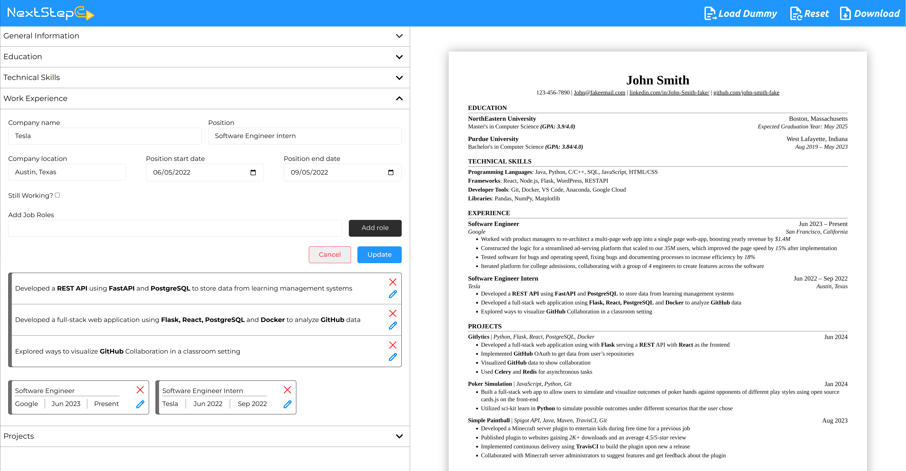

# NextStepCV

Make the next step in your career. A CV Maker to streamline Professional CV Creation.

#### Domain - https://next-step-cv.vercel.app/

   

## Features

- ATS-friendly
- Professional Template - Software Engineer CV
- Real-time Preview
- Responsive UI
- Mobile Friendly - Features a Unique Layout
- Load Dummy - Load a dummy CV to see what's possible
- Reset - Clear all and Start fresh
- Bold/Italic styles for list items - Use \* and \_ before word for Bold and Italic text respectively
- Download the Resume - Made possible with React-pdf
- Continue right where you left off - Data storage on Page Refresh and Revisits

## Technologies

- HTML & CSS - Language
- JavaScript - Language
- React - Library
- Vite - Bundler
- React-pdf - Library
- Vercel - Cloud Platform
- LocalStorage - Browser API

## Project Plan

For a detailed thought process and planning behind building this project, please refer to the [Project Plan Document](./project-plan.md).
